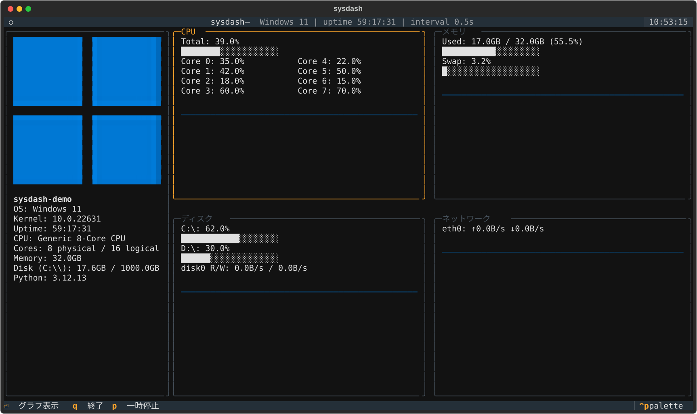
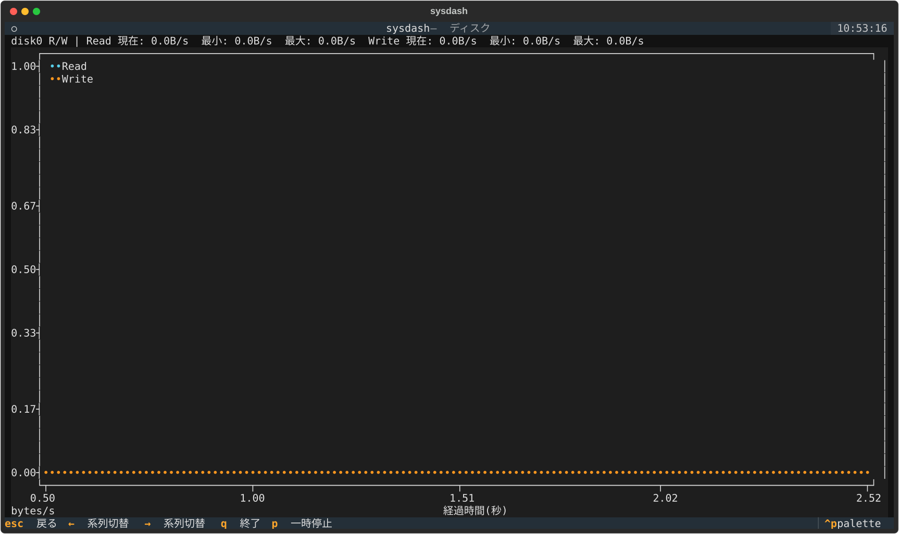

# sysdash

ターミナル上でCPU・メモリ・ディスク・ネットワークをリアルタイム表示するクロスプラットフォームCLIシステムモニタダッシュボードです。Python ([psutil](https://github.com/giampaolo/psutil) + [Textual](https://github.com/Textualize/textual)) 製。

## スクリーンショット

ダッシュボード画面(左にfastfetch風のシステム情報サイドバー、右に2x2グリッド。パネル内にミニグラフ表示。CPUパネルはコア数が多い場合パネル幅に応じて複数列に自動で並ぶ):



グラフ画面([textual-plotext](https://github.com/Textualize/textual-plotext)による目盛り付き折れ線グラフ。X軸=経過時間(秒、右端が現在)、Y軸下限は0固定。ディスクのRead/Write・ネットワークの送信/受信はそれぞれ色分け+凡例付きの2系列で同時表示):



## 特徴

- CPU(合計+コア別)・メモリ(使用率+Swap)・ディスク(マウント毎使用率+R/W速度)・ネットワーク(NIC毎送受信速度)を1秒間隔でリアルタイム表示
- fastfetch風のシステム情報サイドバー(OSロゴ・OS/カーネル・ホスト名・uptime・CPU・コア数・メモリ容量・システムドライブ(Windows=`C:\`、Unix系=`/`)の使用量・Pythonバージョン)を十分広いターミナル幅では常時表示
- OSロゴはピクセルアート(半ブロック文字)で表示。Linuxは `/etc/os-release` から主要16ディストリ(Ubuntu/Debian/Fedora/Arch/Mint/Manjaro/openSUSE/Raspberry Pi OS/RHEL/CentOS/AlmaLinux/Rocky/Kali/Alpine/Pop!_OS/Gentoo)を自動判別して専用ロゴを表示し、その他はTuxにフォールバック。ターミナル幅140以上ではサイドバーが広がり高解像度版ロゴに切り替わる
- ターミナル幅に応じて2x2グリッド → 1カラム縦積み → コンパクト表示(数値のみ)に自動追従。サイドバーは2x2グリッドの中でも特に幅が広い場合のみ表示され(2x2グリッド自体になる幅ではまだ表示されないことがある)、狭い表示では隠れて本体の表示幅を確保する。CPUパネルのコア別表示もパネル幅に応じて複数列に自動で並ぶ
- 各パネルからEnterで全画面の折れ線グラフ(履歴300点、目盛り付き、Y軸下限0固定)に遷移し、左右キーでコア別・マウント別・NIC別の系列を切替。ディスクはRead/Write速度の2系列(使用率はグラフ対象外。ダッシュボードパネル側のマウント使用率表示は従来通り)、ネットワークは送信/受信の2系列を色分け+凡例付きで同時表示
- 項目単位で取得に失敗してもその項目だけN/A表示になり、他の項目・パネルは継続動作
- 一時停止(`p`)・更新間隔変更(`+`/`-`、`--interval`)に対応
- システムロケールを自動判定して日本語/英語UIを切り替え(`--lang ja`/`--lang en`で明示指定も可能)

## 必要環境

- Windows / Linux / macOS(いずれかの64bit環境)
- [uv](https://docs.astral.sh/uv/) がインストール済みであること(Pythonのインストール・実行環境の管理に使用)

## インストール

```bash
git clone https://github.com/soraebi/sysdash.git
cd sysdash
uv sync --no-dev
```

`uv sync --no-dev` が Python 3.12 系と実行に必要な依存パッケージ(psutil, textual)を自動的に用意します(テスト等の開発用依存は含みません)。

## 使い方

```bash
uv run sysdash
```

更新間隔を変更する場合:

```bash
uv run sysdash --interval 2.0
```

`--interval` は秒単位で指定します(0.5〜10秒にクランプされ、クランプが発生した場合は起動後に実際に使われる値が通知されます)。

### キーバインド

| キー | 動作 |
| --- | --- |
| `q` | 終了 |
| `Tab` / `Shift+Tab` / 矢印キー | パネル選択(ダッシュボード画面) |
| `Enter` | 選択中パネルのグラフ画面へ遷移 |
| `Esc` | ダッシュボード画面へ戻る |
| `←` / `→`(グラフ画面内) | 同カテゴリ内の系列(コア別・マウント別・NIC別等)を切替 |
| `p` | 一時停止/再開(一時停止中はヘッダに `PAUSED` と表示され、履歴も伸びません) |
| `+` / `-` | 更新間隔を0.5秒刻みで変更(0.5〜10秒) |

## 対応OS

- Windows・Linuxで動作確認済み
- macOSは psutil の公式クロスプラットフォームAPIのみを使う設計のため動作する見込みですが、実機での動作確認はまだ行っていません

## 既知の制約

- ターミナルは Windows Terminal を推奨します(標準の `conhost` では罫線・色付けが崩れる場合があります)
- 終了(`q`やCtrl+C)は即座に反映されます。一時停止(`p`)は現在実行中のtick(psutil呼び出し1巡)が完了してから反映されます。いずれの操作も、実行中の `psutil` 呼び出し自体を途中で中断することはありません
- macOS/Linuxでの動作確認はREADME記載の範囲にとどまり、CIによる自動検証は未整備です

## 単一実行ファイル化

[PyInstaller](https://pyinstaller.org/) で単一実行ファイル(`--onefile`相当)にビルドできます。リポジトリ直下の `sysdash.spec` を使います。

```bash
uv sync
uv run pyinstaller sysdash.spec
```

`dist/sysdash.exe`(Windows。Linux/macOSでは拡張子無しの `dist/sysdash`)が生成されます。生成物はuv環境やPythonのインストールに依存せず単体で動作します。

動作確認(TUIを起動せず、収集経路だけを自動検証するスモークテスト):

```bash
# Windows
dist\sysdash.exe --smoke

# Linux / macOS
./dist/sysdash --smoke
```

`collectors=<件数> samples=<件数>` が出力されexit code 0で終了すれば成功です(collectorが1つも無い、または1件もサンプルが取れなかった場合はexit code 1でstderrに理由が出ます)。この出力は`--lang`によらず常に英語固定です(CI等の自動処理での言語非依存性を優先しているため)。Windows 11実機でのビルドでは、ファイルサイズ約15MB、`--smoke` の起動から終了までの所要時間は平均約1.4秒(3秒未満)でした。

PyInstallerは実行したOS向けのバイナリしか作れません(クロスビルド不可)。Linux/macOS向けに作る場合は、それぞれのOS上で同じ`uv sync && uv run pyinstaller sysdash.spec`を実行してください。

**注意点**:
- コード署名をしていないため、初回実行時にWindows SmartScreenやセキュリティソフトの警告が表示される場合があります。
- Linux向けバイナリはビルドした環境のglibcバージョンに依存します。ビルド環境より古いディストリビューションで実行すると動かないことがあるため、配布対象の中で最も古い環境でビルドしてください。

## 開発

```bash
uv sync
uv run pytest
```

`uv sync`(`--no-dev`を付けない)でテスト等の開発用依存(pytest等)も含めて用意します。

## ライセンス

[MIT License](LICENSE)
